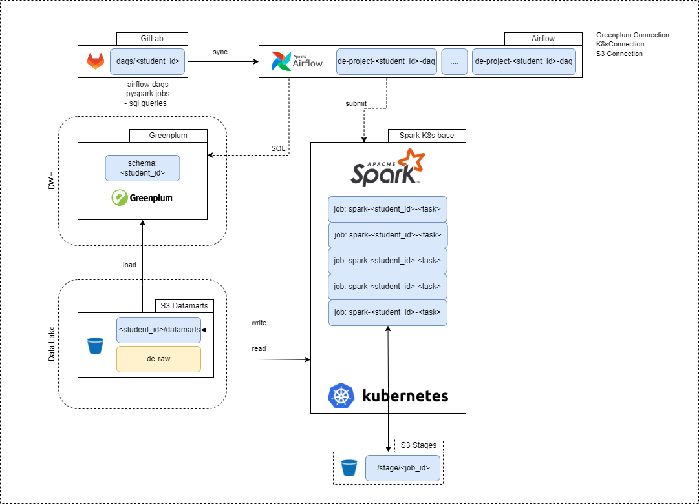

# Основной проект курса Data Engineer от [karpov.courses](https://lab.karpov.courses/)

## Цель проекта
Получить представление о совместной работе _**DWH**_, _**Data Lake**_ и **_Data Orchestrator_** на примере _Greenplum_ \ _Spark_ \ _Airflow_, приближенное к реальной работе Data Engineer

### Состав проекта: 

- пять запросов на _Spark_, объединенных в один DAG Airflow

- пять запросов на _Greenplum_, объединенных в один DAG Airflow

### Образовательные результаты проекта: 

- использование изученных инструментов в связке: _Airflow_, _Spark_, _Greenplum_

- понимание, как строятся пайплайны обработки данных в озере данных и DWH

- построение отчётов DE по ТЗ от заказчика

## Описание данных
В проекте мы с вами будем использовать данные, предоставляемые из [Теста TPC-H](https://www.tpc.org/tpch/)

Исходные данные, с которыми мы будем работать, размещены в S3 бакете по пути - /de-project _(VK.Cloud)_

TPC-H - это стандартный бенчмарк для тестирования производительности систем управления реляционными базами данных (RDBMS). Он состоит из набора запросов, которые используются для оценки производительности обработки запросов на чтение больших объемов данных из базы данных.

TPC-H был разработан Transaction Processing Performance Council (TPC) - некоммерческой организацией, которая занимается разработкой стандартов и методов для тестирования производительности систем обработки транзакций. Бенчмарк состоит из 22 запросов, которые покрывают широкий диапазон типов запросов, таких как агрегирование, слияние таблиц и фильтрация данных.

TPC-H используется для тестирования производительности RDBMS на больших объемах данных, таких как решения хранилища данных и системы аналитики. Он помогает выявлять узкие места в производительности системы и оптимизировать её работу при работе с большими объёмами данных. Результаты тестирования TPC-H используются для сравнения производительности разных систем RDBMS.

## Техническая инфраструктура

В качестве технической инфраструктуры будут использованы следующие инструменты. 
1. Озеро данных на базе _S3_
2. Аналитическое хранилище на базе _Greenplum_
3. Оркестратор потоков данных - _Airflow_
4. Кластер распределенных вычислений _Spark (Kubernetes)_
5. _GitLab_ для хранения исходного кода

Интеграция между GP и Spark будет проходить через внешние таблицы с хранением в S3.